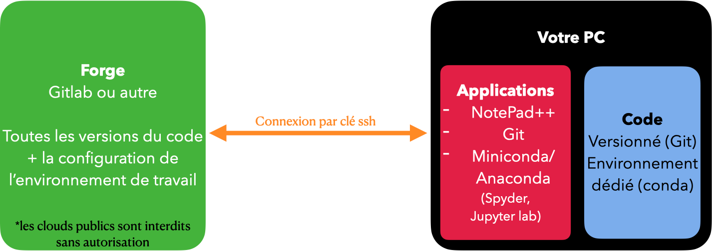

# Instruction d'installation

## Avant toute installation d'outils

Pour ce parcours Python, nous allons nous reposer sur la création d'un environnement python dédié.

Se reposer sur le monde du libre est simple pour le côté administratif et financier mais peut se révéler très gourmand en temps de compréhension. Cette compréhension peut également se retourner contre nous lorsqu'il s'agit de maintenir un code, un projet. Une nouvelle version de Python arrive chaque automne avec ces nouvelles fonctionnalités et d'anciennes qui deviennent des erreurs de fonctionnement. A cela se rajoute les différentes versions des modules et packages qui se reposent sur les bases du langage Python et très souvent sur d'autres modules et packages.

Vous l'aurez compris, maintenir un environnement de travail stable est tout simplement impossible dans le temps. En revanche, pour créer des environnements dédiés, en enregistrer sa configuration, le partager et/ou le réinstaller est un grand pas vers la reproductibilité. Pour ceux qui utilise Linux, je ne peux que leur conseiller de jeter un oeil à [GUIX](https://www.inria.fr/fr/guix-un-logiciel-libre-pour-la-reproductibilite-des-sciences-en-hpc). Nous n'utiliserons pas cet outils mais c'est pour votre culture G ;)

### Comment travailler avec des environnements dédiés ?

Plusieurs options existent, bienvenue dans le monde du libre.

- Python contient un module de base qui se nomme [`venv`](https://docs.python.org/fr/3/library/venv.html)
- Anaconda ou Miniconda contiennent Python et ajoute un gestionnaire de modules, packages et environnement nommé `conda`. C'est la solution sur laquelle nous nous reposerons. Attention, il y a encore quelques pièges qui arrivent principalement au moment des nouvelles versions de Python lors de la création d'environnement.
    - Anaconda est beaucoup plus riches en modules et packages que Miniconda ce qui explique d'ailleurs qu'il s'installe avec la version Python 3.8 actuellement. La compatibilité arrive mais toujours avec un peu de délai pour assurer un bon fonctionnement.
    - Miniconda est la base d'Anaconda et permet d'atteindre Anaconda si nous en avions besoin mais c'est très rarement le cas. Anaconda est un excellent début pour l'analyse données mais il contient beaucoup trop de choses pour être écologique. Je vous recommande Miniconda puis d'ajouter à votre environnement les modules et paquets que vous avez besoin.

Je n'irai pas plus loin dans les autres options mais intéressons nous au partage d'un environnement.

### Comment partager un environnement dédié ?

D'abord, que contient un environnement dédié :

- Une version de Python
- Des versions de modules et paquets

Il permet de faire fonctionner un code sur un PC. Enfin, ça c'est son but. En attendant, il va falloir coder pour atteindre un code fonctionnel. Le contenu de cet environnement est donc amené à évoluer au cours du développement. Vous allez me dire qu'il faut versionner. C'est sûr mais restons concentré sur notre environnement Python, nous reviendrons sur la gestion de version de notre code par la suite qui est une couche supplémentaire.

Un environenment dédié est donc une version de Python et un certain nombre de modules et packages Python qui sont amenés à évoluer. Lors du développement, cet environnement n'est pas fixe. Et même si vous n'utilisiez que des releases de code, il est fort à parier que pour chaque release, l'environnement dédié soit différent.

Partager un environnement ne se fait pas avec un simple copier/coller car il contient lors de la création des chemins absolus un peu trop nombreux. Il faut passer par un extracteur de nom et version de chaque partie de cet environnement (version de Python et de chaque modules et/ou packages).
C'est à ce moment que le gestionnaire de paquet `pip` est utile lorsque nous avons créé un environnement avec `venv` sinon `conda` fait la même chose en indiquant si le module a été installé depuis la commande `conda install un_module` ou la commande `pip install un_module`. Conda et Pip ne pointe pas vers les mêmes sources sur le web. Les sources conda ont l'avantage d'être déjà compilées.

L'extraction du contenu de notre environnement dédié s'obtient avec les commandes suivantes :

> pip freeze > requirements.txt

> conda env export le_nom_de_l_environnement.yml

Le point faible commun a ses deux commandes est que la sortie est une extraction à un instant dans le développement. Il ne faut donc jamais oublier de les relancer après chaque installation de nouveaux paquets. C'est fastidieux mais tellement important pour le partage et le maintien de votre projet.

Un environnement par projet est la règle. Vous ne pourrez pas maintenir sur votre PC l'ensemble des environnements. Cette extraction est donc la solution pour recréer à posteriori ce même environnement sur le même ou un autre PC avec le même OS ou non.

Si vous vous intéressez à Python, c'est que vous êtes comme moi, un fainéant. Et oui, nous le verrons mais en quelques lignes, vous êtes proches de refaire le monde ;)

Je vous dit ça car il y a un petit nouveau qui montre un intérêt pour palier le point faible précédent. Il s'appelle `Poetry`
Poetry va donc être une troisième option dans la création d'environnement et dans la gestion des dépendances de l'environnement puisqu'il va mettre à jour à chaque nouvelle installation de module à partir d'un premier appel à la commande `poerty lock`.
Je vous avoue ne pas encore avoir franchi le pas mais ça ne serait tarder ;) Si vous le souhaitez, n'hésiter pas pour cette formation et je vous aiderai au mieux.

Dans ce paysage des environnement dédié et surtout du partage, il manque un cas de figure où ce que je viens de vous dire n'est pas suffisant. Certains d'entre vous font peut-être appel à des librairies particulières renseignées dans vos variables d'environnement du système d'exploitation. Cette configuration apporte son lot de difficulté pour partager et faire tourner un code sur un autre PC. C'est à ce moment qu'un GUIX ou OS virtuel va prendre son sens (VMWare, Parallels ou VirtualBox) ou des systèmes de conteneurs (Docker ou Rocket). Ces dépendances présentes sur les PC de développeurs et non présentes sur les PCs des chercheurs. Des souvenirs d'heures de recherche pour connaitre qui est manquant au projet...

### Versionner son travail

Maintenant que nous avons fait le tour des notions de l'environnement de support de travail (Python), il ne faut pas oublier qu'à chaque étape, il faut versionner son code. Qu'on travail seul ou à plusieurs, c'est un gain d'espace disque puisque le système de versionning ne va enregistrer que les différences de codes entre deux versions. C'est un gain de temps puisque vous pouvez visualiser les changements réalisés sur des interfaces web comme les forges (GitLab, Redmine, SourceSup). C'est un gain de temps également quand vous souhaitez travailler sur une partie du code sans casser ce qui a été fait en créant une branche de travail dédié. Le versionning vous évite de casser quoique ce soit.

Dans le cadre de cette formation, nous utiliserons Git et la plateforme GitUb, un GitLab hébergé à l'université de Bordeaux.

Un support dédié à la mnipulation de Git vous est disponible dans un autre document.

## Installation

### Éditeur de texte

Un éditeur de texte avancé pourra être utile à certains moments de la formation. Pour Windows, [Notepad++](https://notepad-plus-plus.org) est un bon choix.
Naturellement, si vous êtes déjà familier avec un autre éditeur avancé (Atom, Emacs, Sublime Text, …), cela conviendra très bien également.

### Git

Git sera utilisé tout au long de la formation comme outil de versionnement avancé. Vous pouvez installer la version Windows depuis le [site officiel](https://git-scm.com/download/win).
Au cours du processus d’installation, de nombreuses options vous seront proposées. Vous pouvez à chaque étape laisser le choix par défaut et cliquer sur “Next” (à l’exception peut-être de l’étape vous demandant de choisir l’éditeur de texte par défaut utilisé par Git. Choisissez alors Notepad++, ou sinon tout autre éditeur que vous utilisez habituellement).

### Miniconda

Vous pouvez télécharger et installer la dernière distribution : [Miniconda](https://docs.conda.io/en/latest/miniconda.html#latest-miniconda-installer-links)

Vous pouvez remarquer que c'est la version Python 3.9.5 qui sera installé de base. Avec [Anaconda](https://www.anaconda.com/products/individual), c'est la version 3.8 de Python.

Pour ces deux distributions dont une seule suffit, je vous recommande de la désinstaller chaque année en janvier, laisser l'automne passer pour que vous travailler toujours avec une bonne version d'anaconda ou miniconda.

La gestion des environnements est décrit par [ici](https://docs.conda.io/projects/conda/en/latest/user-guide/tasks/manage-environments.html)

Vous pouvez alors utiliser la [commande](https://docs.conda.io/projects/conda/en/latest/user-guide/tasks/manage-environments.html#creating-an-environment-from-an-environment-yml-file) 
- `conda env create -f python_r_win.yml` depuis le fichier `python_r_win.yml` qui est présent dans le dépôt (remplacez 'win' par 'mac' si vous êtes sur mac).

### Création d'un compte sur gitub

Vous devez créer un compte sur www.gitub.u-bordeaux.fr

Puis ajouter une clé ssh en allant dans `préférences` depuis votre logo en haut à droite de la page web puis `SSH Keys`. L'aide à la génération est disponible à cette adresse https://gitub.u-bordeaux.fr/help/ssh/index#generate-an-ssh-key-pair

Vous pouvez alors faire un fork du dépôt `git@gitub.u-bordeaux.fr:anf_python_r/parcours_python.git`

## Configuration

Pour utiliser sereinement la clé ssh pendant la durée de chaque session, vous pouvez avant de commencer à travailler dans votre terminal entrer les deux instructions suivantes :

> git config --global credential.helper 'cache --timeout=14400'

Ca permettra d'enregsitrer pendant 4h votre passephrase associée à votre clé ssh. L'extension Jupyterlab-git fonctionnera alors sans demander sans cesse votre passe phrase. Sans cet enregistrement vous serez banni temporairement d'accès au gitub de l'université car jupyter-git aura fait trop de demande avec echec d'authentification, ce qui ressemble a une attaque par force brute.

Sous Mac, vous devez ajouter cette commande :

> ssh-add -k ~/.ssh/id_ed25519
